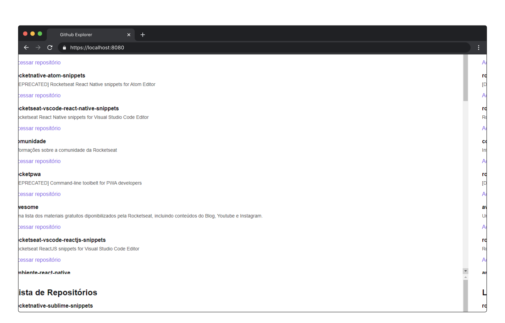

<p align="center">
  
</p>

## 🧪 Tecnologias

Esse projeto foi desenvolvido com as seguintes tecnologias:

- TypeScript
- ReactJS

## 🚀 Uso

```bash 
git clone https://github.com/gutemberg-jhonata/github-explorer.git
cd github-explorer
yarn dev
```

## 💻 Projeto

O Github Explorer é uma aplicação desenvolvida durante o bootcamp Ignite, na trilha ReactJS. Trata-se de uma aplicação simples que lista os repositórios do Github. Sendo desenvolvida com o objetivo de rever os conceitos básicos do ReactJS, sendo estes: componentização, estados, propriedades e imutabilidade.
